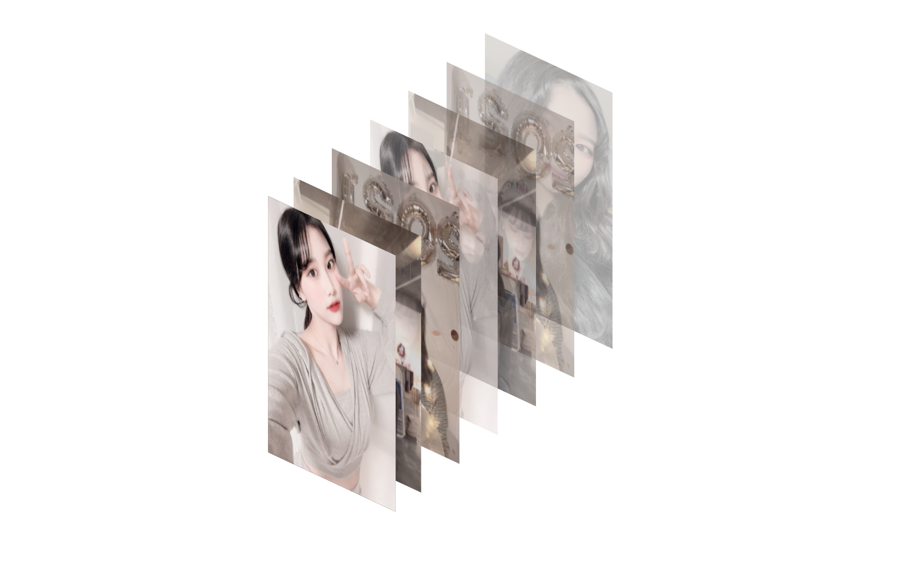

# 심심할때마다 하나씩 해보는 css

🤩 심심할때마다 css를 가지고 놀아볼까 합니다!

🐷 해당코드의 html file을 로컬에서 보면 애니메이션도 볼 수 있습니다.
codepen에 올려 볼 수 있도록 업데이트 하겠습니다.

### 🐥 굴러가는 박스

[코드](https://github.com/cksal0805/perfect-css/tree/main/run)
online tutorials 유튜브 선생님의 아이디어를 보고 만들어보았습니다!


### 🐥 나만의 사진첩

[코드](https://github.com/cksal0805/perfect-css/tree/main/frame)
hover animation 입니다!



### 🐥 돌아가는지구

[코드](https://github.com/cksal0805/perfect-css/tree/main/star)


### css 최신 기술

**@support**

해당 css를 지원하는지 체크해서 적용시켜줌

```css
@support (display: grid) {
  div {
    display: grid;
  }
}
```

지원하지 않는건 아래 처럼 체크

```css
@support not (display: grid) {
  div {
    display: flex;
  }
}
```

**Css scroll snap**

스크롤이 어떠할지 결정해줌

적용방법: scroll-snap-type을 부모에게 지정

```css
#container {
  scroll-snap-type: y mandatory;
}
.children {
  scroll-snap-align: center;
}
```

**:is()**

적은 코드로 수 많은 요소를 선택할 수 있음

```css
/* before */
header button,
nav button,
form button {
  background-color: tomato;
}

/*after*/
:is(header, nav, form) button {
  background-color: tomato;
}
```
